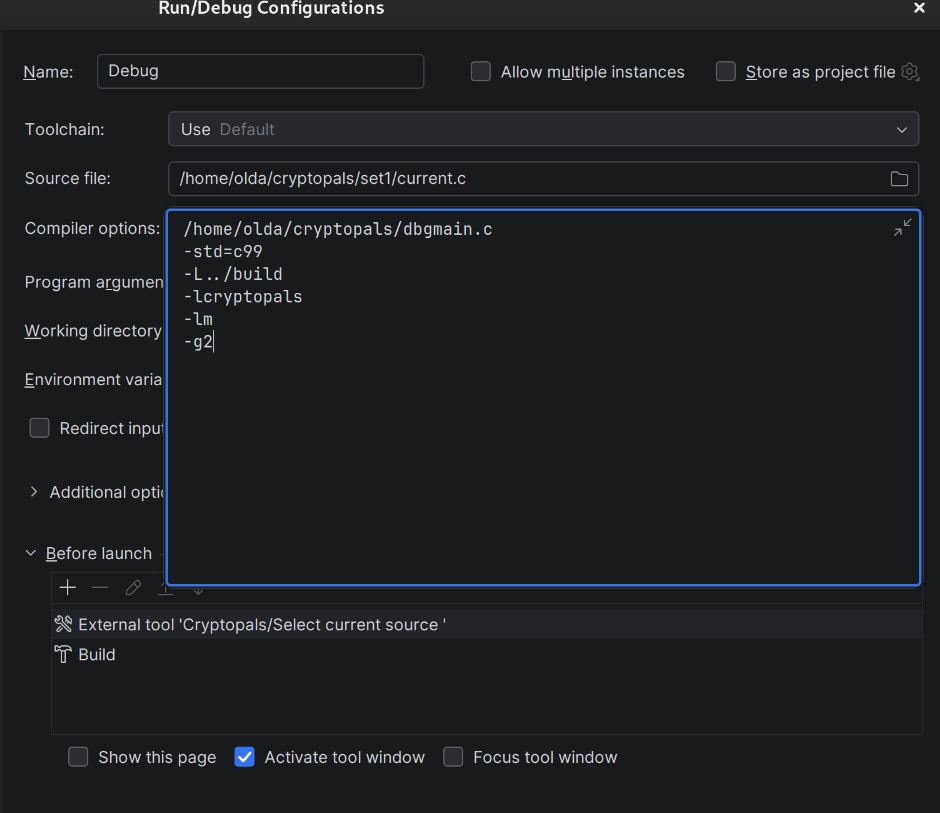
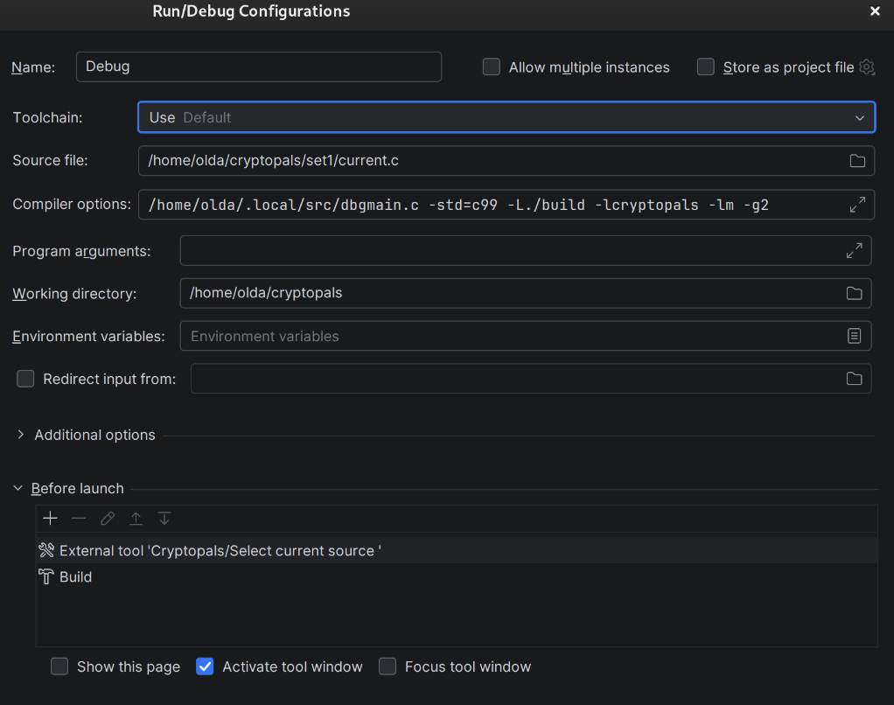

# Cryptopals C
This is a set of solutions for the [cryptopals](https://cryptopals.com) cryptography challenges, implemented in pure C.

Each challenge has its own .h file and .c file which implement the necessary functions and are built to be generally reusable, and a main.c file, which invokes those functions on the input for each challenge to test them.

I attempt to write clean, memory-safe reusable code that solves the chalenges iteratively, building up on each other, while providing reusable code that's usable as-is.

Reusable structs, pointers and cleanup functions are all provided to make the code as readable, clean and straight-forward as possible.

# Build
A makefile is provided for convenience. The needed C libraries are listed below. To compile the binaries (the main.c files), simply invoke `make`, or `make ./bin/setX-chXX` to build a specific challenge.

The binaries can found in the `bin` folder, named `setX-chXX`, according to the set and challenge. Source files are in the `setX` folders, according to the set.

### Set 1

- Challenges 01+: the C standard library
- Challenges 07+: The OpenSSL library (apt package `libssl-dev` or `openssl-devel`)

# Notes
- The code is built with the C99 standard in mind and may not work with older C standards.
- Each main file (and binary built in `./bin/`) accepts arguments to provide the functionality for other inputs than the challenge-provided inputs. If no arguments are provided, challenge input is assumed.
- A set of functions for reading and decoding files (hex or base64) can be found in the `set1/ch04.[h/c]` files. Files may be read fully, or line-by-line, decoding the whole buffer or individual lines at a time.

# IntelliJ
Due to the modularized structure of the C files, and especially the secondary expansion in the Makefile, IntelliJ struggles to compile and debug code. To work around this, two shell utility functions have been provided in the root folder.
***
`select-ch-bin.sh` - add this as an external tool, then set up your "Run" configuration as a `Native application`:

You may now invoke this while viewing the `chXX.c` file, to compile and run the `chXX_main.c` file for that challenge. 
***
`select-ch-src.sh` - add this as an external tool, then set up your "Debug" configuration as a `C/C++ file`:

You may now click "Debug" on this configuration while viewing the `chXX.c` file. There is a breakpoint in the boilerplate `dbgmain.c` file to simulate gdb "start" (stop immediately before execution). You may now open the `current.c` file and set breakpoints there to be registered in the GDB through IntelliJ.